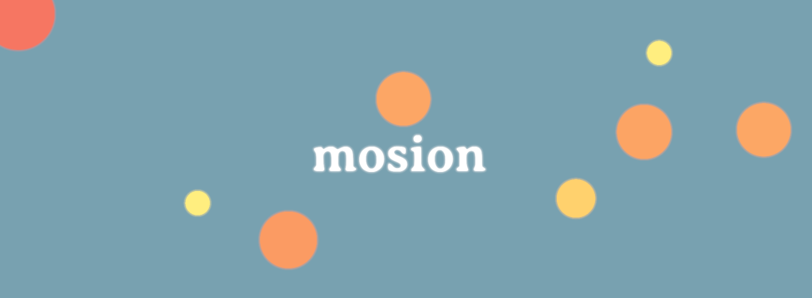
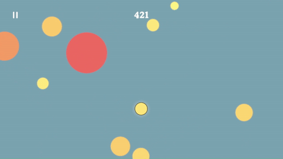

# mosion-game
Be a circle. Absorb circles. Grow.

mosion is a game with simple controls and a simpler premise. Absorb circles smaller than you, avoid circles bigger than you.

mosion was built using Godot 4, can be compiled to run on almost any host system (excluding Safari browsers, at the time of writing), and gracefully adapts to almost any aspect ratio.

## Inspiration

mosion was motivated by a desire to capture the feel of janky but addictive flash games of the noughties and early mobile games. The closest reference for most players will be the Cell Stage of Spore, but the gameplay is closer to Fishy or the Neopets game Jelly Blobs of Doom.

The absorption mechanic and overall vibe of mosion aims to be a spiritual predecessor to Osmos. If you haven't played Osmos, drop whatever you are doing and play it now.

Pseudolegalese: mosion (and Loudifier) is not affiliated with any other game, studio, or publisher.

## Play mosion

mostion is avaialable for $1 for Windows and Android at [loudifier.itch.io/mosion](https://loudifier.itch.io/mosion)

I am in the process of getting mosion approved on Google Play, where it will be available for Android in both ad-supported and ad-free versions. iOS may come soon, if I can justify the cost of an Apple developer's licence and a cheap Mac.

To play mosion for free without ads:
- Clone this repo
- Download Godot. If you have trouble compiling with the latest version of Godot, mosion was built with [version 4.2.1](https://godotengine.org/download/archive/4.2.1-stable/)
- Open Godot, import the mosion project, and click play. Personalization like compiling the game for your target system or setting an appropriate starting window size or orientation is an exercise left to the reader
- To disable ads, find the variable ad_free in the main.gd script and set it to true