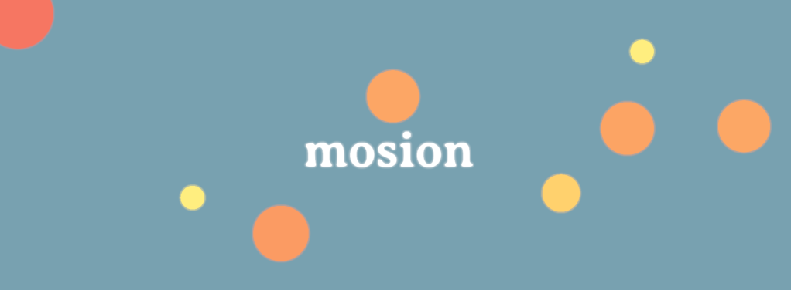
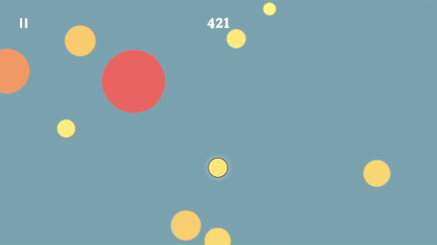

# mosion-game

Be a circle. Absorb circles. Grow.

mosion is a game with simple controls and a simpler premise. Absorb circles smaller than you, avoid circles bigger than you.

## Inspiration

mosion was motivated by a desire to capture the feel of early mobile games and janky but addictive flash games of the noughties. The closest reference for most players will be the Cell Stage of Spore, but the gameplay is closer to Fishy or the Neopets game Jelly Blobs of Doom.

The absorption mechanic and overall vibe of mosion aims to be a spiritual predecessor to Osmos. If you haven't played Osmos, drop whatever you are doing and play it now.

Pseudolegalese: mosion (and Loudifier) is not affiliated with any other game, studio, or publisher.

### [Play mosion](https://loudifier.github.io/mosion-game/)